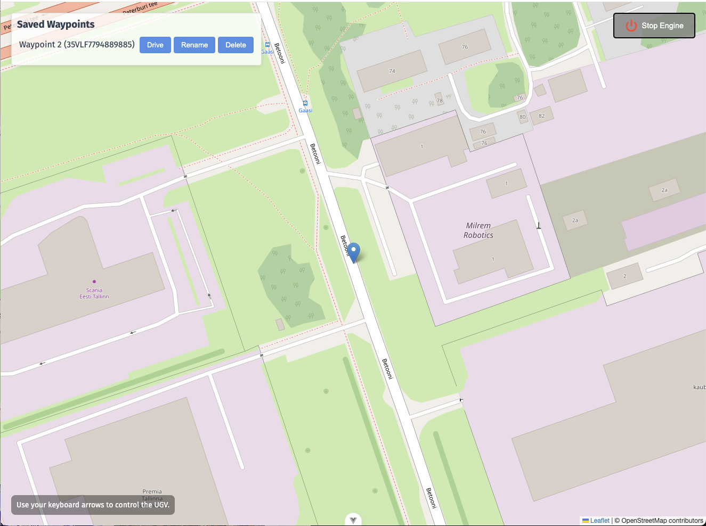

# UGV System Interface Prototype

This repository contains an interactive prototype of an Unmanned Ground Vehicle (UGV) control interface, developed as part of the Milrem Robotics internship assignment.

The application simulates engine control, manual navigation, and waypoint management for a UGV using Vue 3, TypeScript, and Leaflet.

## Demo Video

A demonstration video showcasing all features of the application is included in the root directory of this repository. 

[](https://github.com/liinabakhoff/milrem_ugv_ui_prototype/blob/main/MilremUGV_Demo_LiinaMaria.mov)

## Features

- Engine Control: Start and stop the UGV engine with clear visual feedback.
- Manual UGV Navigation: Control the UGV position using keyboard arrow keys (available only when the engine is running).
- Waypoint Management:
  - Long press on the map to create a waypoint.
  - Options to drive to, save, or discard the waypoint.
  - Manage saved waypoints: drive to location, rename, or delete.
- Map Integration: Real-time position updates using Leaflet.
- Dynamic Notifications: Display information, warning, or success messages with smooth transitions.
- Modal Dialogs:
  - Rename waypoint modal with focus management.
  - Support for keyboard accessibility (Escape to cancel, Enter to confirm).
- Coordinate Display: Waypoints are shown using the MGRS (Military Grid Reference System).
- Clean and responsive user interface designed for clarity and usability.

## Technologies Used

- Vue 3 with Composition API
- TypeScript
- Vite (build tool)
- Leaflet.js for map visualization
- MGRS library for coordinate format
- CSS for component-scoped styling

## Getting Started

### Prerequisites

- Node.js version 16 or higher
- npm package manager

### Installation

1. Clone the repository:

   ```bash
   git clone https://github.com/your-username/milrem_ugv_ui_prototype.git
   cd milrem_ugv_ui_prototype

   ```

2. Install dependencies:

   ```bash
   npm install
   ```

3. Start the development server:
   ```bash
   npm run dev
   ```
   Open http://localhost:5173 in your web browser.
4. Optional: Build the application for production use:

   ```
   npm run build
   ```

## Usage Instructions

### Start Engine

Click the **Start Engine** button located at the top-right corner.

### Manual Movement

Use keyboard arrow keys to move the UGV on the map.

> Note: Engine must be running to enable movement.

### Creating Waypoints

- Long press on the map to place a temporary waypoint.
- Available options:
  - **Drive**: Move UGV immediately to the waypoint.
  - **Save**: Add the waypoint to your saved list.
  - **Discard**: Remove the temporary waypoint.

### Managing Saved Waypoints

- View saved waypoints in the side panel.
- For each waypoint, you can:
  - **Drive**: Navigate the UGV to the waypoint.
  - **Rename**: Update the name of the waypoint (supports keyboard accessibility).
  - **Delete**: Remove the waypoint from the list.

## Project Structure

```
src/
├── assets/                         # Global styles
├── components/
│   ├── controls/                   # Engine button and movement controls
│   ├── map/                        # Map container and waypoint management
│   ├── ui/                         # Notifications, modals, and popups
│   └── waypoints/                  # Waypoint list and individual items
├── App.vue                         # Main application component
├── main.ts                         # Application entry point
├── MilremUGV_Demo_LiinaMaria.mov   # Demo recording
```

## Reflection

### Challenges Faced

The most challenging part of the assignment was learning Vue.js in a very short timeframe. Although I have previous experience with React, and the overall concept of component-based frontend frameworks is familiar to me, Vue’s specific syntax and ecosystem were new.

To quickly get up to speed, I dedicated focused time to learning and practice. I followed a Vue 3 course on Udemy by Maximilian Schwarzmüller, which helped me grasp the fundamentals like the Composition API, Vue's reactivity system, event handling, and component communication.

Being able to apply what I was learning directly to this project helped me solidify my understanding much faster and made the learning process both practical and rewarding.

### Use of AI Systems

I used AI systems, specifically ChatGPT, as a learning and productivity aid during this assignment.

ChatGPT was helpful for:

- Planning the project structure and breaking down tasks.
- Understanding Vue-specific concepts and Composition API patterns.
- Troubleshooting bugs and receiving suggestions for cleaner code practices.
- Exploring alternatives and performance considerations (e.g., local state management versus Pinia).

Importantly, I did not use AI to generate the full solution or bypass the development process.
